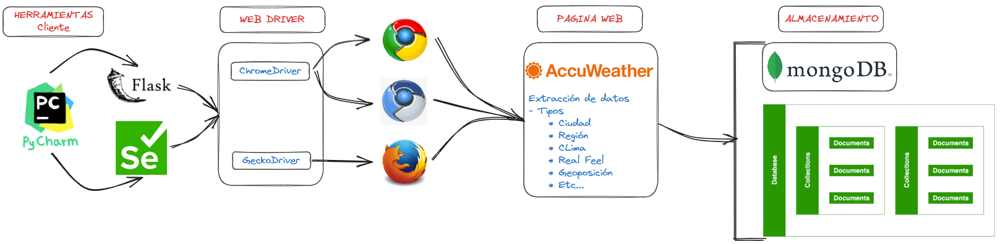

# Tratamiento_de_Datos_Proyecto_Scraping-Weather

===============================================================================
## Ronald Matute Solorzano

-----

Este es un repositorio para extraer información de la web, el objetivo final es obtener una visión general del tratamiento de datos desde su obtención hasta su almacenado.

## Knowledge
Por medio de la siguiente imagen podemos ver un poco la estructura de como extraemos datos de la pagiina de AccuWeather.

## Description

Extracción del clima de [AccuWather](https://www.accuweather.com/) de las ciudades de:
* Guayaquil 
* Quito y 
* Cuenca.

Como sabes el clima es un dato que se encuentra en constante cambio, incluso en cuestión de minutos, por lo que este codigo registra el clima cada 
minuto, pero se puede moficar a que el tiempo este definido de otra forma.

## Required Modules

>import schedule

>import time

>from selenium import webdriver

## Data extraction
Definimos las url semillas, que en este caso son 3, y que corresponden a las Ciudad de:
* Guayaquil 
* Quito y 
* Cuenca.
        
start_urls = ['https://www.accuweather.com/es/ec/guayaquil/127947/weather-forecast/127947',
              'https://www.accuweather.com/es/ec/quito/129846/weather-forecast/129846',
              'https://www.accuweather.com/es/ec/cuenca/127442/weather-forecast/127442']

