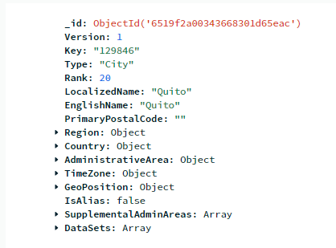

# Tratamiento_de_Datos_Proyecto_Scraping-Weather

=====================================================================
## Ronald Matute Solorzano

-----

*Este es un repositorio para extraer información de la web, el objetivo final es obtener una visión general del tratamiento de datos desde su obtención hasta su almacenado.*

## Knowledge
Por medio de la siguiente imagen podemos ver un poco la estructura de como extraemos datos de la pagiina de AccuWeather.

## Description

Extracción del clima de [AccuWeather](https://www.accuweather.com/) de las ciudades de:
* Guayaquil 
* Quito y 
* Cuenca.

Como sabes el clima es un dato que se encuentra en constante cambio, incluso en cuestión de minutos, por lo que este codigo registra el clima cada 
minuto, pero se puede moficar a que el tiempo este definido de otra forma.

## Required Modules
> ### Algúnos de los modulos que se utilizó:

    import schedule
    import time
    from selenium import webdriver
    from selenium.webdriver.common.by import By
    from mongodb import MongoConnection

## Data extraction
Definimos las url semillas, que en este caso son 3, y que corresponden a las Ciudad de:
>* Guayaquil 
>* Quito y 
>* Cuenca

    start_urls = ['https://www.accuweather.com/es/ec/guayaquil/127947/weather-forecast/127947',
                  'https://www.accuweather.com/es/ec/quito/129846/weather-forecast/129846',
                  'https://www.accuweather.com/es/ec/cuenca/127442/weather-forecast/127442']

Una vez definidas las URL que nos van a servir, accedemos a cada una de ellas. Una por cada 
iteración. Dentro del for, esperamos unos segundos a que se carguen los datos de la página, para así 
acceder al nombre, al clima actual y el clima general.

Cada uno de los datos extraídos se lo trato de guardar en un archivo llamado ***datos-clima.csv.***

    def extra_clima():
        driver = webdriver.Chrome()

        for url in start_urls:
            driver.get(url)

            time.sleep(4)

        weather = driver.find_elements(By.CLASS_NAME, "cluster-container")
        for driver in weather:
        ciudad = driver.find_element(by=By.TAG_NAME, value='//h1').text
        current = driver.find_element(by=By.CSS_SELECTOR, value='//a[contains(@class, "cur-con-weather-card")]'
                                                           '//div[@class="temp"]').text
        real_feel = driver.find_element(by=By.CSS_SELECTOR, value='//a[contains(@class, "cur-con-weather-card")]'
                                                             '//div[@class="real-feel"]').text

        real_feel = real_feel.replace(__old='RealFeel®', __new='').replace(__old='°', __new='').replace(__old='\n', __new='').replace(__old='\t', __new='').replace('\r', '').strip()
        current = current.replace(__old='°', __new='').replace(__old='\n', __new='').replace(__old='\t', __new='').replace(__old='\r', __new='').strip()

        f = open("datos-clima.csv", "a")
        f.write(f"{ciudad},{current},{real_feel}\n")
        f.close()

        document = {
            "City": ciudad,
            "Current": current,
            "Real Feel": real_feel
            }

        col.insert_one(document=document)

        print(ciudad)
        print(current)
        print(real_feel)
        print("\n")

        driver.close()

Asi mismo estos datos se los tratos de almacenar en una base de MongoDB.

    db_client = MongoConnection().client
    db = db_client.get_database('Weather')
    col = db.get_collection('Time')

Una vez definida la función que permite hacer la extracción, invocamos la 
función repetidas veces para que los datos se estén extrayendo automáticamente cada minuto 
(nuevamente, el tiempo se puede modificar). Este programa usa schedule para ejecutar la función cada cierto tiempo específico.

    schedule.every(1).minute.do(extra_clima)

    extra_clima()

    while True:
        schedule.run_pending()
        time.sleep(1)

-----

-----
## MongoDB

Con el api.py pudimos lograr extraer datos de la pagina de [AccuWeather](https://www.accuweather.com/)
de la ciudad de Guayaquil.

De la siguiente imagen podemos sacar algunos datos importante como:
* Geoposition
* Key
* Region
* Country
* Time Zone
* otros datos adicionales...

Con el siguiente codigo podemos sacar datos los datos meteorologicos de una API como ya 
lo pudimos ver en la imagen de la parte superior.

    def get_and_save_data():
        api_key = "pvz9KfqGkplheifoqWYUwmccrBPPXfu4"
        url = f"http://dataservice.accuweather.com/locations/v1/129846?apikey={api_key}"
        response = requests.get(url)
        data = response.json()

#### Datos importantes:

>**_api_key:_** Llave que se utilizan para autenticar y autorizar el acceso a servicios web, bases de datos u otras aplicaciones en línea.

>**_Key:_** Es una numeración que hace referencia a una locacion de una ciudad, en este caso tenemos en el 
> ejercicio: **129846** que hace referencia a la ciudad de UIO.
> 
>